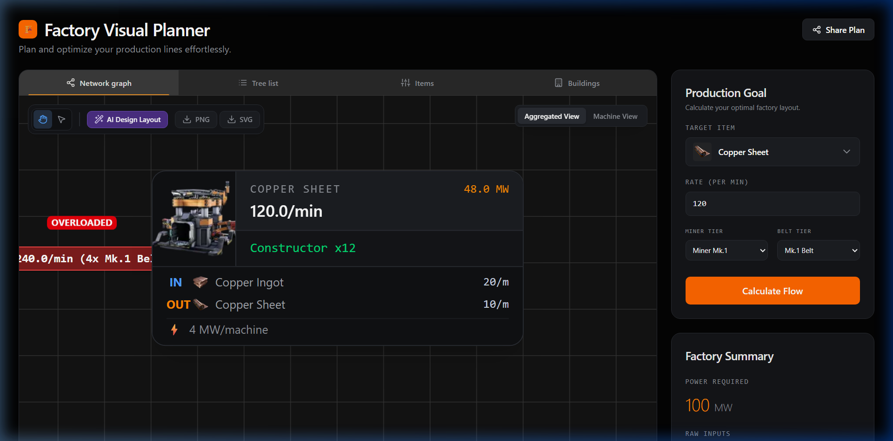
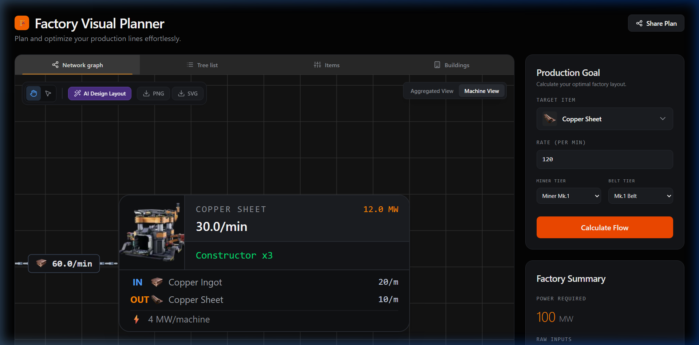
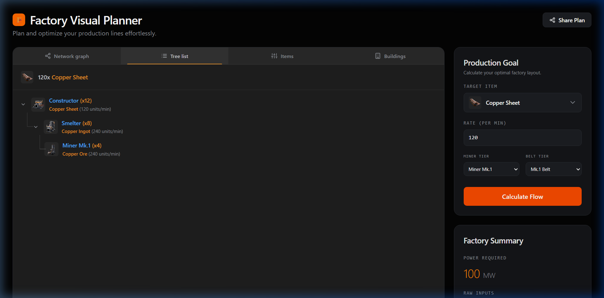
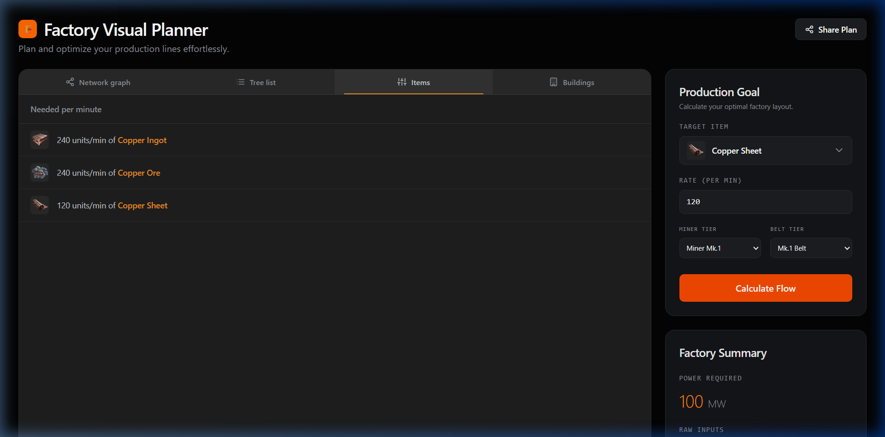
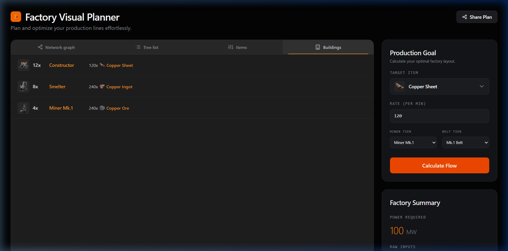

<div align="center">

#  Factory Visual Planner

### A production line calculator & visualizer for [Satisfactory](https://www.satisfactorygame.com/)

Plan, optimize, and share your factory layouts — from raw resources to final products.



</div>

---

##  Features

###  Network Graph
Interactive flowchart visualization of your entire production chain powered by [React Flow](https://reactflow.dev/). Drag, zoom, and pan through your factory layout. Each node shows the machine type, item produced, rate per minute, and power consumption. Belt overload warnings are highlighted in red.


###  Machine View
Switch from **Aggregated View** (grouped by recipe) to **Machine View** (expanded per-machine arrays) to see how your factory will physically look with splitters, mergers, and manifold belt routing.



###  Tree List
A collapsible, hierarchical tree view of the full production chain. Quickly see what each building step requires — with machine icons, multiplier counts, and throughput rates.



###  Items
A flat breakdown of **every item** needed per minute across your entire production chain — including intermediates and raw resources. Sorted by rate for quick reference.



###  Buildings
See exactly how many of each building type you need, what each one produces, and the total power required. Perfect for planning your factory floor.



---

##  Additional Features

| Feature | Description |
|---|---|
| **Miner Tier Selection** | Choose between Miner Mk.1, Mk.2, or Mk.3 — extraction rates adjust automatically |
| **Belt Tier Selection** | Select belt speed (Mk.1 – Mk.5) to see overload warnings when throughput exceeds capacity |
| **Power Summary** | Total power consumption calculated across all machines |
| **Share Plan** | Generate a shareable URL link that encodes your entire plan (item, rate, miner, belt, layout mode) |
| **Export** | Export your graph as PNG or SVG directly from the toolbar |
| **AI Design Layout** | Reorganize graph layout with one click |
| **Factory Summary Sidebar** | At-a-glance stats: power, raw inputs, and building counts |

---

##  Tech Stack

- **Framework**: [React 19](https://react.dev/) + [TypeScript](https://www.typescriptlang.org/)
- **Build Tool**: [Vite](https://vitejs.dev/)
- **Graph Visualization**: [React Flow](https://reactflow.dev/) ([@xyflow/react](https://github.com/xyflow/xyflow))
- **Graph Layout**: [Dagre](https://github.com/dagrejs/dagre)
- **Styling**: [Tailwind CSS v4](https://tailwindcss.com/)
- **Image Export**: [html-to-image](https://github.com/nicojones/html-to-image)
- **Animations**: [Motion](https://motion.dev/)

---

##  Project Structure

```
src/
├── engine/
│   ├── data.ts          # Item, recipe, machine & belt definitions
│   ├── solver.ts        # Recursive production chain solver
│   └── graphMapper.ts   # Converts solver output to React Flow nodes/edges
├── components/
│   ├── InputForm.tsx     # Production goal input form
│   ├── Summary.tsx       # Factory summary sidebar
│   ├── TreeList.tsx      # Hierarchical tree view
│   ├── ItemsTab.tsx      # Items breakdown tab
│   ├── BuildingsTab.tsx  # Buildings breakdown tab
│   ├── ItemModal.tsx     # Item detail modal
│   ├── Dashboard.tsx     # Dashboard panel
│   └── Graph/
│       └── FactoryGraph.tsx  # React Flow graph component
├── App.tsx               # Main application shell
└── index.css             # Global styles & design system
```

---

##  Supported Items

The planner currently supports **21 items** across the early-to-mid game:

| Category | Items |
|---|---|
| **Copper Chain** | Copper Ore → Copper Ingot → Copper Sheet, Wire → Cable |
| **Iron Chain** | Iron Ore → Iron Ingot → Iron Plate, Iron Rod → Screw → Reinforced Iron Plate |
| **Steel Chain** | Iron Ore + Coal → Steel Ingot → Steel Beam, Steel Pipe → Encased Industrial Beam |
| **Assembly** | Rotor, Stator → Motor, Modular Frame → Heavy Modular Frame |
| **Raw Resources** | Copper Ore, Iron Ore, Limestone, Coal |

---

##  Getting Started

### Prerequisites

- [Node.js](https://nodejs.org/) (v18 or later)

### Installation

```bash
# Clone the repository
git clone https://github.com/pratyanj/Satisfactory_tool.git
cd Satisfactory_tool

# Install dependencies
npm install
```

### Run Locally

```bash
npm run dev
```

The app will start at `http://localhost:3000`.

### Build for Production

```bash
npm run build
npm run preview
```

---

##  How It Works

1. **Select a target item** (e.g., Copper Sheet) and desired **production rate** (items/min)
2. **Choose your miner tier** and **belt tier** to match your in-game progression
3. Click **Calculate Flow** — the solver recursively computes:
   - How many machines of each type you need
   - The throughput rate at every stage
   - Total raw resources and power required
4. **Explore the results** across 4 visualization tabs
5. **Share your plan** with a URL link or **export** the graph as an image

---

##  Contributing

Contributions are welcome! Feel free to open issues or submit pull requests.

---

##  License

This project is open source under the [Apache 2.0 License](LICENSE).
